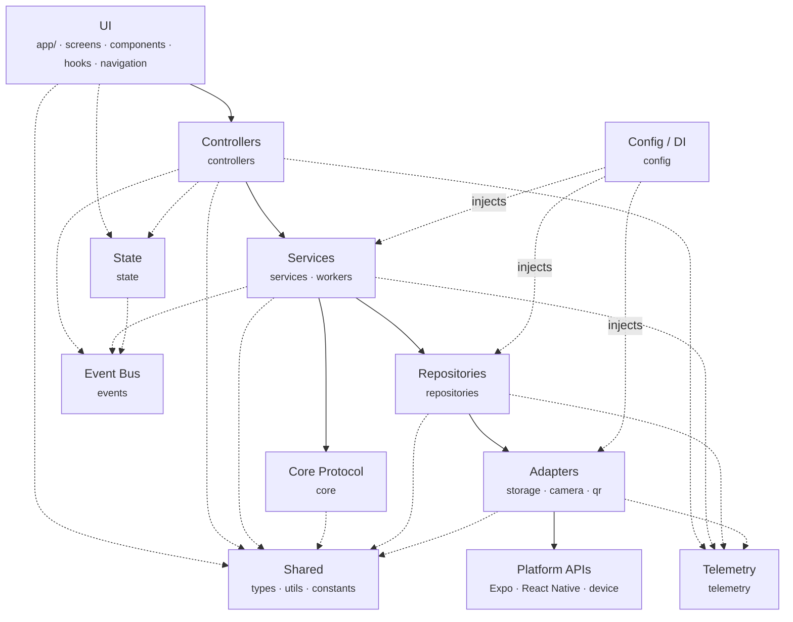
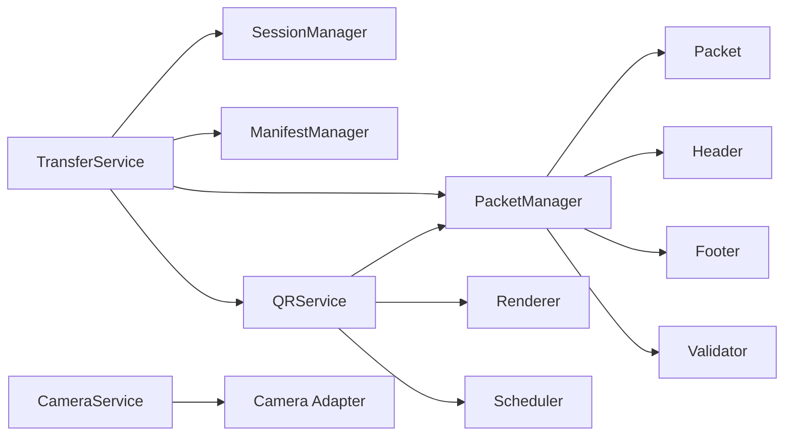

# Photon Dependency Graph

**Status:** Derived view — not a specification.

The authoritative rules are `planning/DEPENDENCIES.md` (what may depend on
what) and `docs/ARCHITECTURE.md` (system organisation). This page exists so
that both can be checked at a glance. If this diagram and those documents ever
disagree, **those documents win** and this page is wrong.

Every edge below is enforced by `npm run lint`.

---

## 1. Layer graph

Dependencies flow downward only. There are no upward edges and no cycles.



Solid edges are the layer hierarchy. Dotted edges are cross-cutting: state,
events, shared utilities, and the composition root.

Note that `core` reaches `types`, `utils` and `constants` but **not**
`telemetry` or `events`. `planning/DEPENDENCIES.md` §4 allows the core only
domain models and utilities, and a logger or a bus is a side-effecting
collaborator: the core receives one as an argument if it needs one at all.

Plain-text equivalent:

```text
UI → Controllers → Services → Core Protocol → Repositories → Adapters → Platform APIs
```

---

## 2. One place the specification is ambiguous

`planning/DEPENDENCIES.md` §3 lists the hierarchy as
`… → Core Protocol → Repositories → Adapters`, which reads as though the core
protocol may import repositories. But §4 lists the core's allowed dependencies
as domain models and utilities only, and §11.9 requires the core to stay
"dependency light" and platform independent.

**We implement the stricter §4 reading: there is no `core → repositories`
edge.** The core protocol computes over values handed to it; services own the
composition of protocol and persistence. This keeps the core testable against
`test_vectors/` with nothing mocked, and it is what `eslint.config.js`
enforces.

This is a reading of the specification, not a change to it. If the intent was
the looser hierarchy, `planning/DEPENDENCIES.md` should say so and this graph
and the lint rule both follow.

---

## 3. Why `config` points upward

`src/config` is the **composition root**. It is the one module allowed to name
concrete implementations, because its whole job is to construct the object
graph and inject it (`planning/DEPENDENCIES.md` §8).

This is not a layer violation: nothing _imports_ `config` in order to do work —
`config` imports everything in order to wire it, once, at startup. Every other
module receives its collaborators as parameters.

---

## 4. Module edges

From `planning/DEPENDENCIES.md` §5.



---

## 5. Directory map

| Directory                                     | Layer            | May depend on                                 | Must NOT depend on                              |
| --------------------------------------------- | ---------------- | --------------------------------------------- | ----------------------------------------------- |
| `app/`, `src/screens`, `src/components`       | UI               | Controllers, hooks, state, navigation, shared | Core, services, repositories, adapters, workers |
| `src/hooks`                                   | UI               | Controllers, state, React                     | Core, repositories, adapters                    |
| `src/navigation`                              | UI               | Expo Router, constants                        | Services, core, repositories                    |
| `src/controllers`                             | Controllers      | Services, state, events                       | React, React Native, Expo, UI                   |
| `src/services`, `src/workers`                 | Services         | Core, repositories, events, shared            | UI, controllers, React Native                   |
| `src/core`                                    | Core Protocol    | Domain types, utils, constants                | Everything else, including all platform APIs    |
| `src/repositories`                            | Repositories     | Storage adapters, domain types                | UI, controllers, services, React Native         |
| `src/storage`, `src/camera`, `src/qr`         | Adapters         | Platform APIs, shared                         | Core, services, controllers, repositories, UI   |
| `src/state`, `src/events`                     | Cross-cutting    | Domain types                                  | Screens, navigation, adapters                   |
| `src/config`                                  | Composition root | Any layer (wiring only)                       | —                                               |
| `src/types`                                   | Domain models    | `@utils/errors` only                          | Every other module                              |
| `src/utils`, `src/constants`, `src/telemetry` | Shared           | Nothing (leaf modules)                        | Every other module                              |

The eight major layers each carry a `README.md` stating the same rules in
detail; each `index.ts` points to its README.

---

## 6. Invariants

1. **Downward only.** No module imports from a layer above it.
2. **No cycles.** Enforced by `import/no-cycle` at any depth.
3. **Core is platform-free.** `src/core` compiles with no React Native or Expo
   present, which is what makes it testable against `test_vectors/`.
4. **Adapters are the only platform surface.** Device APIs are named in
   `src/storage`, `src/camera`, `src/qr` and nowhere else.
5. **Repositories are the only persistence surface.** Nothing reaches storage
   around them.
6. **UI holds no business logic.** A screen that computes something the
   protocol cares about is a defect.
7. **Injection, not construction.** Concrete implementations are named in
   `src/config` only.

---

## 7. Enforcement

| Rule                    | Mechanism                                                      |
| ----------------------- | -------------------------------------------------------------- |
| Layer boundaries        | `no-restricted-imports` groups per layer, `eslint.config.js`   |
| Circular dependencies   | `import/no-cycle`, all depths                                  |
| Alias resolution        | `tsconfig.json` paths, mirrored in `jest.config.js`            |
| Continuous verification | `npm run verify`, and `.github/workflows/ci.yml` on every push |

A violation fails the build. Boundaries that are only written down are
boundaries that erode.
